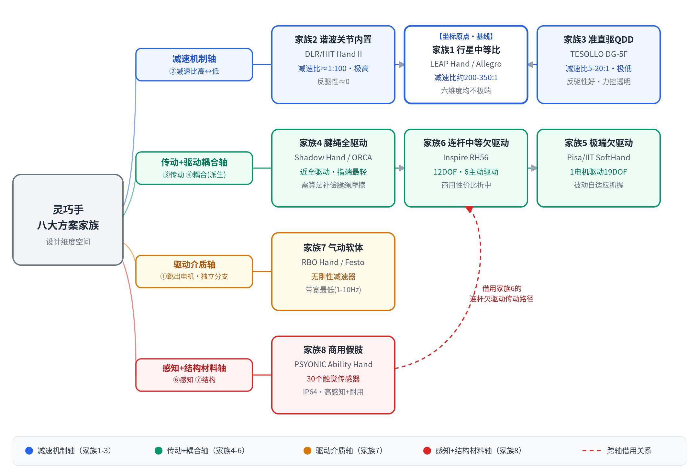

# 经典方案家族与代表产品

## 一句话结论

灵巧手不是"四选一"，而是一批在设计维度空间里各自走到某个极端的经典方案，很多方案之间只差一两个维度的改动就能相互推导。这篇把八个代表性"方案家族"和真实产品对应起来，方便把抽象的设计维度落到具体案例上；每个家族标出它在哪个维度上走到了极端，以及有哪些真实变体。

## 八个方案家族

### 家族1：关节内置 + 中等减速比（行星） + 全驱动 —— "够用党"基线

代表：**LEAP Hand**（CMU, RSS 2023），详见 [01-经典案例入门：LEAP Hand](<01-经典案例入门：LEAP Hand.md>)。这是本知识库选定的坐标系原点，六个评价维度都不极端，工程维护最突出。

变体演化：

- **LEAP Hand V2**：只改了④驱动耦合这一个维度——从16个电机全驱动改成8个电机+差动关节刚度，往欠驱动方向挪了一格，换取更低成本更简单的控制。
- **LEAP Hand V2 Advanced**：直接跳出了这个家族——改成腱绳驱动+软硬混合外壳，相当于同时改了③传动路径和⑦结构材料两个维度，变成了家族4的新成员。
- 同家族友商：**Allegro Hand**（Wonik Robotics）——同样关节内置+全驱动，16个torque-controlled关节，333Hz CAN总线控制，是同一设计点的不同实现，详见 [方案1-关节内置舵机](驱动-减速-传动/方案1-关节内置舵机.md)。

### 家族2：关节内置 + 谐波减速（极高比≈1:100） + 全驱动 —— "工业精度党"

代表：**DLR/HIT Hand II**。谐波减速比约 1:100，BLDC电机约15g/额定转速6000rpm，单关节最大输出扭矩可达2.4N·m，每个手指关节配有基于应变片的关节力矩传感器。

这是在②减速机制这条轴上，从家族1的"中等比"继续往"更高比"推一格的极端——力矩密度和位置精度是六个维度里最突出的，代价是反向可驱动性几乎为零（谐波减速器的物理特性决定），所以额外加装了关节力矩传感器来弥补力控精度。这正好呼应了⑥感知配置可以部分弥补②减速机制短板的结论。

> 说明：这就是知识库里"四大主流方案对比图"里第三个方案（谐波关节内置）对应的真实产品，和 [方案3-准直驱QDD](驱动-减速-传动/方案3-准直驱QDD.md) 是减速机制这条轴上的两个不同点，不是同一个方案——详见下方"和已有文档的关系"。目前还没有独立的深挖文档，先在此记录关键数据。

### 家族3：关节内置/近关节 + 准直驱QDD（极低比5–20:1） —— "力控透明党"

代表：**TESOLLO DG-5F**，详见 [方案3-准直驱QDD](驱动-减速-传动/方案3-准直驱QDD.md)。

这是在②减速机制这条轴上，往家族2的**反方向**推到极端——牺牲力矩密度和紧凑性，换取本体感觉力控和碰撞安全性，不需要外置力矩传感器。家族2和家族3放在一起看，正好是同一条设计轴上的两个相反极端，中间被家族1（行星减速）占据。

### 家族4：腱绳远端 + 全驱动/近全驱动 —— "高自由度仿人党"

代表：**Shadow Dexterous Hand**（执行器远置前臂）、**ORCA Hand**（执行器在腕部，近端）、**Utah/MIT Hand**（早期代表），详见 [方案2-腱绳远端电机](驱动-减速-传动/方案2-腱绳远端电机.md)。

这是在③传动路径这条轴上，从家族1的"关节内置"推到极端"完全移出手掌"，换取指端轻量化和更高自由度密度，代价是需要对腱绳摩擦做算法补偿。

### 家族5：腱绳/连杆 + 极端欠驱动（1电机控制19DOF） —— "自适应抓握党"

代表：**Pisa/IIT SoftHand**。1个电机+1根腱绳穿过所有关节，靠被动弹性元件做伸展复位，19个自由度全部通过"adaptive synergy"（源自人手姿态数据库的协同运动模式）被动耦合。

这是在④驱动自由度与耦合这条轴上，从家族4继续往"更少电机"方向推到物理极限——完全放弃独立关节控制，换取极简结构和对物体形状的被动自适应。这是"派生维度④依附于③"的一个绝佳实例：同样是腱绳传动，耦合方式从家族4的近全驱动一路滑到这个极端。目前还没有独立的深挖文档。

### 家族6：连杆 + 中等欠驱动（linkage耦合） —— 商用折中

代表：**Inspire Robots RH56 系列**（在人形机器人赛道很常见，常见配 Unitree G1/H2 等平台）。12个自由度里只有6个主动驱动（拇指2个+其余四指各1个），其余6个通过连杆机构被动耦合（MCP驱动PIP）。

是家族1（全驱动）和家族5（极端欠驱动）之间的中间点——比全驱动省电机省成本，又比1电机19DOF保留更多独立控制能力，是目前商业化人形手最常见的性价比选择。目前还没有独立的深挖文档。

### 家族7：气动软体 + 无刚性减速器 —— "固有柔顺党"

代表：**RBO Hand 2/3**、**Festo BionicSoftHand**，详见 [方案4-气动驱动](驱动-减速-传动/方案4-气动驱动.md)。

这是在①驱动介质这条轴上跳出电机路线的极端，同时连带取消了②减速机制这个环节，换取天然安全的固有柔顺，代价是响应带宽全场最低（1–10Hz）。

### 家族8：连杆欠驱动 + 高密度传感 + 环境耐受 —— 商用假肢/耐用优化型

代表：**PSYONIC Ability Hand**。整手仅490–520g，最大握力66N，30个触觉传感器，IP64防水防尘。

⑦结构材料（环境耐受）和⑥感知配置（高密度触觉）这两个维度打得比大多数研究用手都极端，传动路径是连杆欠驱动（成本和维护优先），是"工程维护"和"感知丰富度"两个维度同时拉满的商用案例。目前还没有独立的深挖文档。

## 全景关系图

八个家族基本铺满了整理出来的设计维度空间：

- 家族2和3是**减速机制轴**的两个反方向极端，家族1在中间。
- 家族4/5/6是**传动路径+驱动耦合**这两条轴组合出的一个梯度：全驱动腱绳（家族4）→ 连杆中等欠驱动（家族6）→ 单电机极端欠驱动（家族5）。
- 家族7是**驱动介质轴**跳出电机路线的独立分支。
- 家族8是**感知+结构材料轴**的商用极端，传动路径本身借用了家族6的连杆欠驱动。

*上图把这四条关系可视化：家族1（LEAP Hand）是坐标原点，向左右分别是减速机制轴上的两个极端家族2、3；传动+驱动耦合轴上家族4→6→5依次减少主动驱动数量；家族7独立于电机路线之外；家族8通过虚线箭头标出对家族6传动路径的借用。*

## 和已有文档的关系（遗留问题闭环）

之前在核对"四大主流方案对比图"时发现过一处不一致：图里第三个方案标的是"谐波关节内置"，但当时 [方案3](驱动-减速-传动/方案3-准直驱QDD.md) 写的是"准直驱QDD"，两者并不是同一个东西。现在结论很清楚：**谐波关节内置对应家族2（DLR/HIT Hand II），准直驱QDD对应家族3（TESOLLO DG-5F）**，它们是减速机制这条轴上的两个不同点，图和文字都没有错，只是原来缺一篇家族2的说明文档，导致看起来像是对不上。后续如果要把方案文档补齐到和这张图完全一一对应，应该新增一篇"方案5-谐波减速关节内置"，把本文档家族2的内容展开成独立深挖文档。

## 参考来源

- [DLR-Hand II: Next Generation of a Dextrous Robot Hand](https://www.academia.edu/16772535/DLR_Hand_II_next_generation_of_a_dextrous_robot_hand)
- [Multisensory Five-Finger Dexterous Hand: The DLR/HIT Hand II](https://www.academia.edu/53114365/Multisensory_five_finger_dexterous_hand_The_DLR_HIT_Hand_II)
- [Adaptive Synergies for the Design and Control of the Pisa/IIT SoftHand](https://www.centropiaggio.unipi.it/sites/default/files/PisaIIT_SoftHand_0.pdf)
- [Characterization, Analytical Planning, and Hybrid Force Control for the Inspire RH56DFX Hand](https://arxiv.org/html/2603.08988)
- [Inspire Robots RH56H1 Dexterous Hand](https://www.knoxlabs.com/products/inspire-robots-rh56h1-dexterous-hand)
- [LEAP Hand V2 Advanced](https://v2-adv.leaphand.com/)
- [PSYONIC Ability Hand](https://www.psyonic.io/ability-hand)

## 待补充

- 家族2（DLR/HIT Hand II）、家族5（Pisa/IIT SoftHand）、家族6（Inspire RH56）、家族8（PSYONIC Ability Hand）目前都只有本文档里的概要数据，还没有像方案1-4那样的独立深挖文档，后续可以按需展开。【待补充】
- Festo BionicSoftHand 的具体参数尚未逐项核实，目前只是作为气动软体家族的补充例子提及。【待核实】
