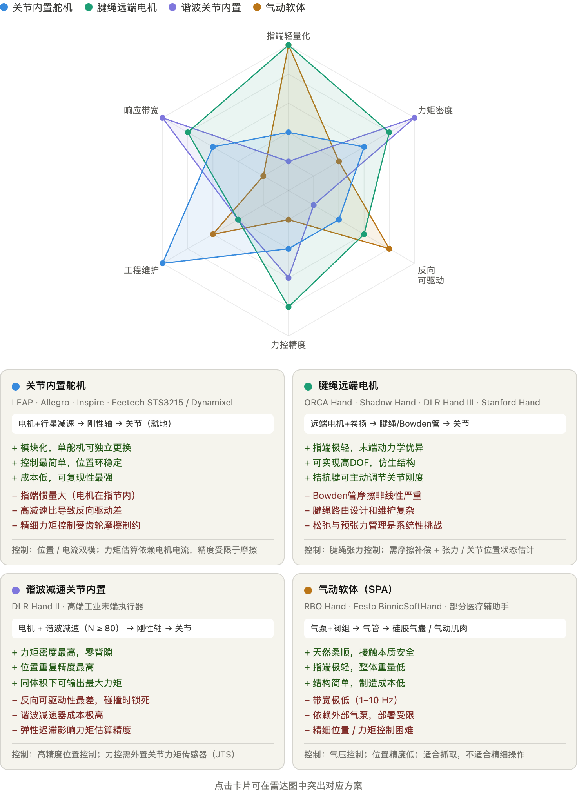

# 概念与方案地图：驱动、减速、传动

## 一句话结论

灵巧手不存在"唯一最先进的机械路线"：电机驱动是绝对主流，真正的分歧在于**把电机放在哪里、用多少减速比、用腱绳还是刚性机构把力送到关节**。这三个选择互相耦合，决定了一只手的重量、力控精度、响应带宽和维护成本。

## 概念解析

驱动、减速和传动是机械与动力系统中三个紧密相连的核心概念：**驱动提供源动力**，**减速负责改变转速与扭矩**，**传动负责将动力连接和传递到目标位置**。

**驱动**：系统的动力源，把电能/化学能/液压能转化为机械能。常见形式：电动机（马达）、内燃机、液压泵。特点是转速高，但初始扭矩往往不足以直接带动重型部件。

**减速**：介于动力源与工作部件之间，通过齿轮箱等结构降低转速、成比例放大扭矩。常见形式：齿轮减速机、行星减速机、谐波减速器。核心目的是"以速度换力量"，并让执行机构运行在稳定、安全的速度范围内。

**传动**：动力的传递路径，把驱动源产生的动力经过路径转换和分配，送到执行机构。常见形式：齿轮啮合、皮带、链条、联轴器、传动轴。核心作用是"连接桥梁"（把动力送到远端或特定角度的部件）和"运动转换"（旋转变直线、改变旋转方向）。

传动机构解决的是"WHERE"问题——已经产生的力/运动如何从驱动器所在位置到达正确的关节，它本身不放大力矩，那是减速器的工作。扭矩的定义、以及行星齿轮减速器/行星丝杠这两种最基础的减速结构，见 [术语词汇表](../../05-术语词汇表/术语词汇表.md)。

**三个概念的独立性**：理论上可以独立选择，但实际设计中深度耦合。选了腱绳传动，减速器必须用卷扬/滑轮形式，放不下谐波减速器；选了关节内置，传动必须是刚性轴；选了气动驱动，通常不需要减速器，气缸直接提供低速大力。

## 灵巧手的机械链

灵巧手的机械链通常是：

> 能量源/驱动器 → 减速器 → 传动机构 → 手指关节与接触面

例如：电源驱动空心杯电机（BLDC）高速运转，转速可达过万转 → 微型行星减速器把转速降到手指弯曲的合理速度，同时把抓握力放大数十倍 → 绕线轮把电机的旋转转换成腱绳的拉力 → 腱绳把手掌/手臂处的动力精准运送到远端指关节（因为电机和减速器塞不进狭小的手指关节）。

其中驱动器决定功率、速度、热管理和可控性；减速器把高速小扭矩变成低速大扭矩；传动机构决定关节如何运动、是否轻、是否柔顺、是否容易维护；手部结构决定自由度、接触面积和可操作性。

## 四大主流硬件组合方案

灵巧手领域的四条主流路线，本质上是"电机放哪里 + 减速比多大 + 力怎么传"这三个变量的四种典型组合：

| 方案 | 电机位置 | 典型减速比 | 反驱性 | 详情 |
|---|---|---|---|---|
| 关节内置舵机 | 关节处 | 约 200–350:1（行星） | 差 | [方案1-关节内置舵机.md](方案1-关节内置舵机.md) |
| 谐波减速关节内置 | 关节处 | 约 1:100（谐波） | 几乎为零 | 代表产品 DLR/HIT Hand II，详见 [03-经典方案家族与代表产品](<../03-经典方案家族与代表产品.md>) 家族2，暂无独立深挖文档 |
| 腱绳远端电机 | 掌部/腕部/前臂 | 卷扬 2–20:1（Capstan） | 中到好 | [方案2-腱绳远端电机.md](方案2-腱绳远端电机.md) |
| 准直驱 QDD | 关节处（大直径薄饼电机） | 5–20:1 | 好 | [方案3-准直驱QDD.md](方案3-准直驱QDD.md) |
| 气动驱动 | 手指本体（气室/软体结构） | 通常无需减速器 | 天然柔顺 | [方案4-气动驱动.md](方案4-气动驱动.md) |

> 说明：早期版本的这张表和"四大主流方案对比图"配图对不上——图里第三个方案画的是"谐波关节内置"，当时文字只写了"准直驱QDD"，两者其实是减速机制这条轴上的两个不同点（谐波极高比 vs QDD极低比），不是同一个方案。现补上"谐波减速关节内置"这一行，完整的方案家族图谱和变体关系见 [03-经典方案家族与代表产品](<../03-经典方案家族与代表产品.md>)。

驱动层面，电机是绝对主流：有刷 DC 电机、无刷直流电机 BLDC、小型伺服电机、线性电机/丝杆电机，配合行星、谐波、齿轮、腱绳、连杆机构等。选择电机是因为其持续输出能力和速度、控制成熟、供应链成熟，能做高频率闭环控制；缺点是占用空间大，自由度越高越明显，关节碰撞风险较高。非电机方案（气动/液压、SMA 形状记忆合金等）很难同时满足力量、速度、寿命、成本、可维护性、控制精度、规模化制造这几项。

减速层面，行星减速器是当前最实用的方案，BLDC + 低到中等减速比行星齿轮 + 腱绳卷线轮是目前工程上最平衡的组合。谐波减速器一般用于腕部、前臂、大关节或高精度机械臂关节，在细小手指里不是最自然的方案。摆线/RV 类减速器更适合人形机器人的腿、腰、肩、肘等大关节，较少用于灵巧手。直驱和准直驱 QDD 是正在研究的前沿方向。

传动层面决定一只手是否"类人"：腱绳/绳索传动是当前高自由度灵巧手最主流的路线，因为它把电机质量从手指移开，代价是需要对动力学做额外建模和校准；关节内置电机主要用于工业夹爪和低自由度手；连杆/四连杆/五连杆传动成本低、耐用，但对高 DOF 不友好，通常需要和腱绳等其他传动方式混合使用。

补充术语（反驱性、响应带宽、力矩密度的定义）见 [术语词汇表](../../05-术语词汇表/术语词汇表.md)。

## 核心维度权衡

**带宽与柔顺性为什么矛盾**：刚度 K 越大，带宽越高，但外力 F 引发的形变（F/K）越小，柔顺性越差。用弹簧-质量系统类比：弹簧能吸收冲击（低频大位移）就必然响应慢（高频跟踪差），换硬弹簧响应快了但碰撞更硬——这不是工程权衡，是控制论的数学定理。柔顺性的实现方式不同，带宽代价也不同：被动机械柔顺（SEA）、主动阻抗控制（软件层柔顺）、固有柔顺（气动、SEA 的被动端）。目前前沿方向是主动阻抗 + 准直驱：用准直驱 + 高带宽关节力矩传感 + 阻抗控制同时逼近两个维度。

## 分歧与共识（汇总）

**分歧**：

1. 学界追求更高自由度、更像人手、更通用的操作能力，偏好高自由度（15–25 DOF）、全驱动或接近全驱动、带触觉的手；工业界解决垂直场景（工厂、仓储、服务机器人），更多用夹爪、低自由度手、三指手。
2. 全驱动 vs 欠驱动：抓取不需要全驱动，复杂在手操作通常需要更多独立控制。
3. 高减速刚性执行器 vs 准直驱柔顺执行器：高减速方案更容易实现紧凑和高力矩；QDD 在高性能接触操作上更有潜力，但热、体积、成本和电控要求更高。
4. 刚性仿人手 vs 软体手：未来可能走向"刚性骨架 + 柔顺关节 + 软指腹 + 触觉传感 + 主动控制"的混合形态。

**共识**：

1. 对于"可部署、可维护、能快速迭代"的研究手，关节内置串行总线舵机已是事实标准（LEAP Hand 在 2023 年后几乎成了 RL dexterous manipulation 论文的默认实验平台）。
2. 对于"精细操作、高 DOF、力控研究"，腱绳远端仍是不可替代的路线——没有其他方案能在指端轻量化和关节 DOF 上同时做到这个水平，这是 ORCA Hand 的赌注所在。
3. 正在出现但尚未主流的方向：关节内置 + 串联弹性元件（SEA-in-joint，牺牲带宽换力控）、准直驱（quasi-direct-drive，中等减速比 1–10:1 + 高力矩电机，牺牲力矩密度换 backdrivability）。这两条路是在关节内置和腱绳远端之间找中间点，目前还没有大规模部署的代表系统。
4. 腱绳仍是高 DOF 人形手最现实的主路线；只增加自由度不增加触觉，收益有限；机械柔顺性不能完全靠软件补出来；真正的瓶颈不只是"手"，而是整套手-臂-感知-学习系统。
