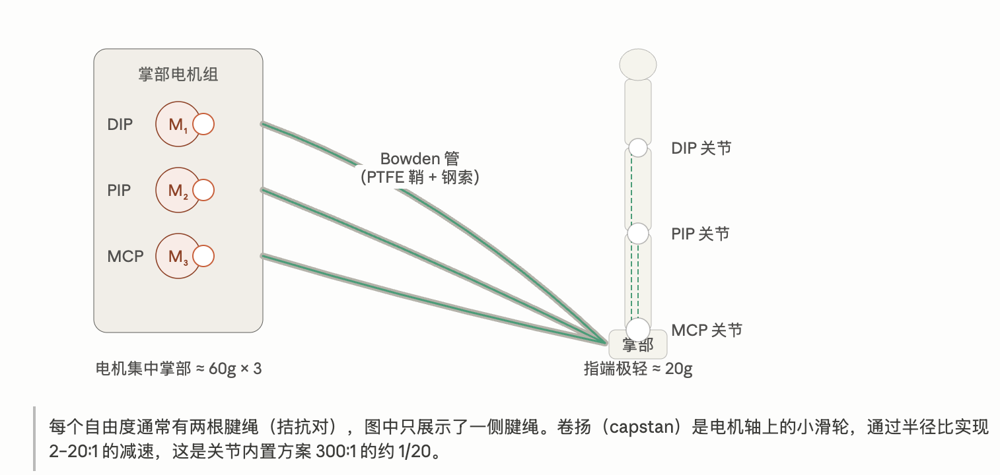
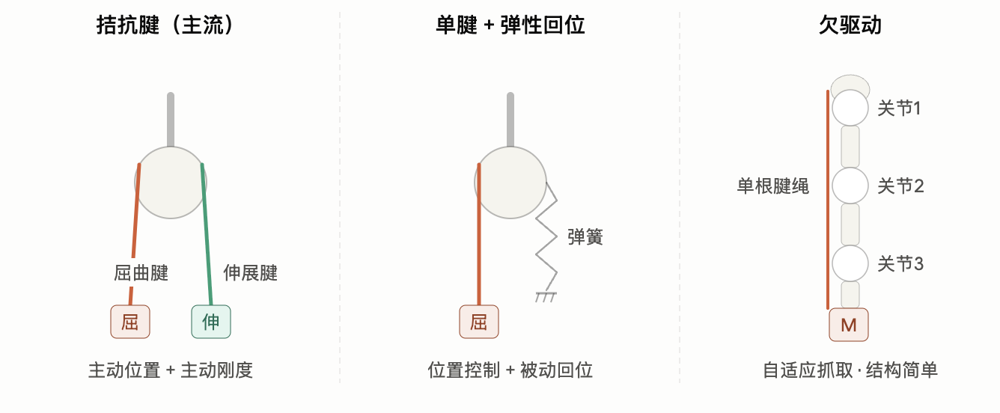

# 方案 2：腱绳远端电机

## 一句话结论

腱绳方案的本质决策只有一个：把电机从"要移动的地方"分离出去。电机留在掌部/腕部/前臂不动，力通过钢索传过来，手指只承载极轻的铰链和导管，是目前在拟人尺寸手里塞进 20+ 主动自由度的几乎唯一刚性方案。

## 和其他方案对比

**核心思路：执行器与关节的空间解耦。** 腱绳远端方案把电机（以及减速器、驱动电路这些又重又占体积的部件）从手指/手掌里挪出去——放到腕部、前臂、甚至独立的电机仓中——然后用腱绳作为柔性传力介质，穿过导向结构把力矩传递到各个手指关节。这本质上是对人手解剖结构的仿生：人手指的精细运动主要由前臂的外在肌通过肌腱驱动，手内几乎不"装肌肉"。

这带来三个根本性的好处：

1. **手指惯量极低**。指节里只有骨架、滑轮和腱绳，没有电机质量，末端惯量小意味着动态响应快、碰撞时冲击能量小、对未建模接触更鲁棒。
2. **自由度密度上限高**。人手指的尺寸装不下"每关节一个电机+减速器"，腱绳传动是目前在拟人尺寸手里塞进 20+ 主动自由度（DoA）的几乎唯一刚性方案。为容纳高自由度，执行器往往被远置于前臂，代表如 Utah/MIT Hand、Shadow Dexterous Hand（[arXiv:2504.03515](https://arxiv.org/html/2504.03515v1)）。
3. **形态拟人化**。手指可以做到接近人指的直径和长度，这对使用人类演示数据（遥操作、视频学习）的 learning pipeline 是实打实的优势——retargeting gap 更小。

腱绳方案内部还要再分"近端"与"远端"：近端（proximal）把电机放在掌背/腕部——ORCA Hand 就是这一类，Feetech 舵机集中在腕部模块，单腱+回位弹簧；真正的"远端"（remote）则把电机推到前臂（Shadow、Optimus）甚至独立电机舱，通过长距离腱-鞘（tendon-sheath）路径传力到手上，这种架构对轻量化人形和移动平台特别有吸引力。远端化程度越高，手越轻，但传动损耗和耦合扰动越严重——这是贯穿本方案所有设计决策的核心张力。

## 是否主流 & 适配的场景

在"高自由度拟人手 + 人形机器人整机"这个赛道上，它正在成为主流；在"中等自由度商用灵巧手"市场上，它不是。

**适合**：需要 16+ 主动自由度做手内操作（in-hand manipulation）研究的平台；手臂负载/惯量预算紧张的人形与移动机器人；需要拟人形态以利用人类数据的模仿学习/VLA pipeline；需要低末端惯量做动态操作（抛接、拨弄）的任务。

**不适合**：粉尘/高温工业环境长期无维护运行、只需要抓取（power grasp 为主）的场景——那里两指夹爪或 6 DoF 连杆手性价比碾压。

## 硬件结构设计

注意：部分电机是把"电机+减速器"组合在一起的，在外置减速器（比如卷扬）工作之前，实际上已经用内置的减速器减速了。

腱绳方案中，拮抗腱是常见的硬件设计方案之一，并不是唯一选择。腱绳方案在四个独立的设计维度上都有不同选择，每个维度各自有 2–3 种硬件实现：**腱绳配置、电机位置、路由方式（力传导到远端的方式）、电机和绳的耦合、关节端机构**。

补充知识（每个维度的概念解释）：

- **电机布置位置**：把电机放在哪里，离手的距离有多远。"远端"指电机不在关节处直接驱动手指，而是放在手腕、前臂、躯干、独立基座等，牺牲驱动/传动的质量，换取末端轻量化。
- **腱绳构型**（手指关节驱动路线）：一根腱绳到底怎么带动多个关节，包括拮抗式、单腱+弹簧回位、欠驱动。
- **腱绳路径/路由方式**（长距离传力路线）：在传递力的过程中如何降低摩擦、提高传动效率。
- **电机和绳的耦合**（减速与卷绕方式）：怎么收放腱绳，这部分误差非常影响性能。
- **关节端机构**（腱绳在关节附近的力矩生成路线）：关节附近采用什么样的机械结构。

### 腱绳配置

维度定义：每个 DOF 用几根绳、怎么组织，决定了能不能主动控制刚度、主动控制屈伸。

- 拮抗腱（双电机双腱）方案多用一倍电机，换来刚度可编程；
- 单电机单腱版本的拮抗腱，牺牲了刚度可编程调节，保持较少的电机使用和主动的屈曲和伸展；
- 欠驱动方案用最少电机换来自适应抓握，但失去对各关节的独立控制。

### 电机位置

电机越远，末端越轻；但"电机编码器角度"越不再等于"手指实际角度"。远距离 Bowden 方案中，套管曲率和机械臂姿态都会造成腱绳有效长度变化，并引入明显摩擦损失。远端方案实际上是牺牲传动质量换极致的末端轻量化。

### 电机和绳的耦合

这个部分决定了如何收放绳。因为机械结构的不同，误差波动也非常大。常见的方案包括：单卷筒/单层绕线，Capstan/绞盘式牵引，双卷筒或同轴双卷筒，电机+减速器+卷筒。

**单卷筒**：ORCA Hand 使用的是单卷筒 Spool，优点是结构简单好打印，缺点是如果多层叠绕，卷筒等效半径会变，导致"电机转一圈对应的收绳长度"不恒定，位置控制会漂。适合原型机，但要尽量做到：单层排线、有导绳槽、卷筒宽度足够、不让绳子交叉压住自己。

**Capstan/绞盘式牵引**：腱绳在主动轮上绕若干圈，靠摩擦传递力，而不是把整根绳缠满卷筒。绞盘一般非常宽，能让绳子不重叠卷在绞盘上，靠摩擦力拉住。优点是连续、可高速、绳长不受卷筒容量强约束，也更容易实现双向驱动；缺点是打滑、磨损、预紧不足时失效，预紧过大又会增加轴承负荷和能耗。

**双卷筒或同轴双卷筒**【可改进的方向】：一对拮抗腱绳分别绕在两个卷筒上，或在同轴正反绕的双槽卷筒上，电机转动时一边收一边放。优点是可以保持两条绳持续张紧，减少空行程和反向死区；缺点是装配与标定更难，左右绳长、绕线半径、预紧量必须匹配。

**电机+减速器+卷筒**：这是最常见的工程组合。减速器提高输出扭矩，但也带来反驱困难、齿隙和机械阻尼。卷筒半径小：力大、分辨率高，但收绳慢、绳磨损更强；卷筒半径大：收绳快、动作幅度大，但手指力下降，电机更容易不够扭矩。

### 路由方式（长距离传力路线）

绳从电机到关节的方式，决定了摩擦特性和结构要求。方式很简单：开放式导轮路由（裸线），Bowden 管路（简化版是 PTFE 管）。

### 关节端机构

决定了绳到关节之后怎么转变成扭矩，决定了力矩-角度的映射关系。比如圆形轮滑给恒定力矩臂。

## 硬件决策路线

不要先从"我要多少个自由度"开始，而是按这个顺序决定：

1. **任务目标**：抓取为主，还是在手操作为主。
2. **目标指尖力与闭合时间**：先决定电机、减速比、卷筒半径。
3. **电机位置**：前臂还是躯干，决定是否必须 Bowden。
4. **每根手指的驱动数**：单腱、双腱还是差动。
5. **走线与张紧**：尽量缩短、减弯、可调预紧、可换绳。
6. **传感闭环**：至少要有电机编码器；远距离方案最好再有关键关节角度和指尖接触/张力信息。
7. **最后才是手指外形和"仿人程度"**。

判断路线：若主要目标是先得到可靠可抓的灵巧手，优先做"远置电机 + 短/中等 Bowden + 单屈曲腱绳 + 被动回位 + 每指独立电机 + 可调张紧"；若目标是精细操作，再逐步把拇指、食指升级为拮抗双腱和传感闭环，而不是第一版就让五根手指全部高度独立化。

远置腱绳路线真正的上限不由"电机多大"决定，而是由走线摩擦、张紧稳定性、关节力臂设计、传感闭环和维护结构共同决定。

以 ORCA Hand 为例，这个方案选择了：拮抗腱单电机 + Bowden 管 + 卷扬 + 圆形关节轮滑。这个组合成本低，控制要求高，需要在算法层面做出补偿才能达到力控精度。
