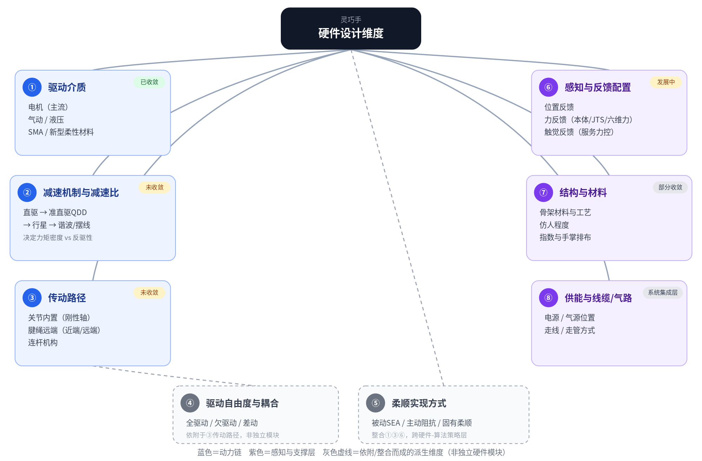

# 设计维度与评价维度

## 一句话结论

后面每一篇具体方案文档（驱动/减速/传动、以及未来的手指结构、传感器等），本质上都是"在若干**设计维度**上做了一组选择，然后在若干**评价维度**上得到一组表现"。这篇先把这两类维度、以及它们之间的对应关系讲清楚，后面的方案文档就不用每篇重复解释"为什么要讨论这个指标"。

## 评价维度：我们到底想要什么

评价维度是结果性指标，每一个背后都对应着具体的任务需求：

- **指端轻量化**：指尖/关节处的转动惯量小。对应场景——快速甩动、抛接物体、高速动作（接抛物体、快速操作按键），指端惯量小才能快速启停不失控。
- **力矩密度**：单位质量/体积能输出的力矩。对应场景——要强力抓握又要控制整手重量/体积（搬重物、工业负载抓取、人形机器人整机负载预算紧张）。
- **反向可驱动性（backdrivability）**：外力能否顺畅地反向推动传动机构。对应场景——人机协作安全（碰撞不伤人）、物理示教/遥操作数据采集（人手推着手动示范）、接触丰富的柔顺装配。
- **力控精度**：精确感知和控制接触力大小的能力。对应场景——精细装配、插拔、易碎物体抓取。
- **工程维护**：部署、复现、长期运行的难易程度。对应场景——科研平台快速迭代、工厂产线长期无人值守运行。
- **响应带宽**：系统跟踪快速变化指令的能力（单位 Hz）。对应场景——防滑落反射、高频微操、动态抓取。

这六个维度的定义详见 [术语词汇表](../05-术语词汇表/术语词汇表.md)。

## 设计维度：我们能选择什么

设计维度是可以独立选择的上游变量，分两层：**一级维度**（整手层面必须独立做出的选择，彼此正交）和**派生维度**（依附在一级维度之上、跨维度整合而成，不是独立的硬件模块）。

**一级维度（6个）**

1. **驱动介质**——电机 / 气动液压 / SMA新材料。已收敛：电机是绝对主流，其余是特定场景的例外选择。
2. **减速机制与减速比**——直驱 → 准直驱QDD(5–20:1) → 行星(100–300:1) → 谐波/摆线(80–160:1+)。未收敛：不同场景对"力矩密度 vs 反驱性"的取舍不同，各档都有稳定生态位。
3. **传动路径**——关节内置（刚性轴）/ 腱绳远端（近端/远端）/ 连杆机构。未收敛：三者分别占据低自由度易维护、高自由度精细操作、低成本工业抓取三个不同生态位。
4. **感知与反馈配置**——位置反馈 / 力反馈（本体电流估算、关节力矩传感器JTS、六维力传感器）/ 触觉反馈。未收敛，快速发展中：能反向修正力控精度的上限，是独立于减速机制之外的一条变量。
5. **结构与材料**——骨架材料与工艺、仿人程度、指数与手掌排布。部分收敛：拟人五指布局基本是共识，材料工艺仍在快速迭代。
6. **供能与线缆/气路管理**——电源/气源位置、走线/走管方式。严格说已进入"手-臂"系统集成层面，但会反向约束手本体的设计选择。

**派生维度（2个，不占用独立硬件插槽）**

- **驱动自由度与耦合方式**（全驱动 / 欠驱动 / 差动）——依附于"传动路径"：同样一条"电机+减速+传动"链路，可以每个关节一条独立链路（全驱动），也可以一条链路靠机械耦合串联服务两个关节（欠驱动）。腱绳传动天然容易做欠驱动/差动，关节内置舵机天然默认全驱动，所以这是传动路径内部还要回答的一个"数量与拓扑"问题，不是并列的第四条动力链维度。
- **柔顺实现方式**（被动机械柔顺SEA / 主动阻抗控制 / 固有柔顺）——整合"驱动介质+减速机制/传动路径+感知配置"三者：固有柔顺是驱动介质选了气动/软体材料的自带副产品；被动SEA是在减速/传动环节插入弹性元件；主动阻抗控制完全是控制算法，依赖力反馈传感器提供输入。它是"用什么手段实现柔顺"的策略选择，横跨硬件和算法两端，不是一个可以单独勾选的硬件模块。

## 思维导图

## 设计维度如何决定评价维度

| 设计维度 \ 评价维度 | 指端轻量化 | 力矩密度 | 反向可驱动性 | 力控精度 | 工程维护 | 响应带宽 |
|---|---|---|---|---|---|---|
| 传动路径 | 主导 | 间接 | 间接 | 间接（腱绳摩擦） | 主导 | 间接（指端惯量） |
| 减速机制与减速比 | 次要 | 主导 | 主导 | 间接（经反驱性传导） | 次要 | 主导 |
| 驱动介质 | 次要（气动最轻） | 次要 | 次要（气动靠材料柔顺） | 次要 | 次要（气源维护负担） | 主导（气动带宽天然低） |

几条关键的因果链：

- **反向可驱动性几乎完全由减速比决定**——减速比越高，反向摩擦按比例放大，backdrivability越差；这是控制论里最硬的一条规律，谐波/行星几乎锁死，QDD/直驱好。
- **力控精度是反向可驱动性的下游结果**——想做本体感觉力控，前提就是backdrivability要好；但可以靠加装力矩传感器（感知配置维度）部分弥补，这是力控精度不完全由减速比决定的原因。
- **指端轻量化主要由传动路径决定，其次影响响应带宽**——电机放关节里指端就重，指端惯量大会拉低系统能达到的闭环带宽，这是传动路径→指端轻量化→响应带宽的一条间接链路。
- **响应带宽还受驱动介质独立影响**——气动方案带宽天然最低（1–10Hz，受气体可压缩性和气路延迟限制），这是和电机方案完全不同的物理限制来源，不经过减速比这条逻辑链。

## 后续导航

这套框架里，**驱动介质、减速机制与减速比、传动路径**（以及依附于传动路径的**驱动自由度与耦合方式**）在 [驱动-减速-传动/00-概念与方案地图](驱动-减速-传动/00-概念与方案地图.md) 及其下属的方案文档里展开。**感知与反馈配置、结构与材料、供能与线缆/气路、柔顺实现方式**这几个维度目前还没有独立的方案文档，规划中会在其他分类（02-控制与算法、以及01-硬件设计下未来新增的子话题）里展开，详见顶层 [知识库地图](../index.md)。
