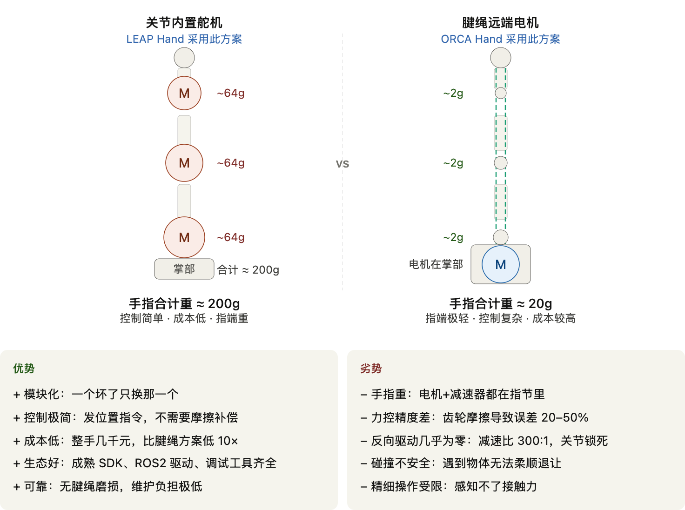
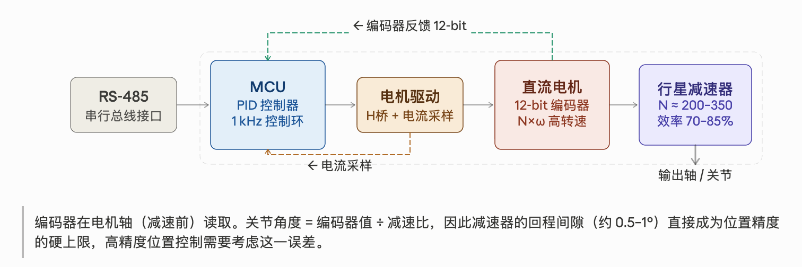
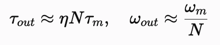

# 路线1：关节内置驱动

## 一句话结论

每个关节配一套"驱动源 + 减速机构 + 位置传感器"，直接放在关节处或紧邻关节，力矩不需要长距离传递。这条路线内部只有**一个自由变量**：减速比选多大——从谐波减速器的极高比（约1:100），到行星减速器的中等比（约200–350:1），再到几乎不减速的准直驱 QDD（5–20:1），三个方案家族其实是同一条设计轴上的三个点，减速比越低，反向可驱动性越好，力矩密度越低。

## 原理：电机放在关节处

典型链路（以串行总线舵机为例）：

> 总线指令（如 RS-485） → MCU（微控制器） → 电机驱动（H 桥） → 直流电机 → 减速器 → 输出轴

同时有两条反馈路径：电机轴上的磁编码器（常见 12-bit，4096 格/圈）把转速和位置报给 MCU；电流采样电路把电机电流报给 MCU（这是力矩估算的数据来源）。MCU 里通常运行三级 PID 闭环：最外是位置环，中间是速度环，最内是电流环。"电流限位置模式"（设目标角度同时设最大电流作为软性力限制）是操作研究最常用的模式。

减速比是这条路线唯一的自由变量：电机原生力矩往往只有 0.01–0.02 N·m 量级，必须靠减速比放大到手指关节所需的 1–4 N·m 甚至更高。但减速比越高，反向效率越低——从外面推关节，需要克服减速比倍数放大的齿轮摩擦才能让关节动起来，感觉像是锁死的。这是这条路线做不好接触力控制的根本原因，是减速器的物理特性，不是软件可以解决的问题；这也是三个方案家族里，减速比越低（QDD）反而力控越透明的原因。

### 逐关节力矩计算：为什么这条路线的力学分析更直观

因为每个关节都有独立的驱动源，第 N 个关节所需的电机输出力矩，只取决于该关节自身的负载力矩和减速比，不需要跨关节耦合计算——大致是 **电机输出力矩 ≈（关节负载力矩 + 摩擦力矩）÷ 减速比**。这和[路线2：腱绳驱动](路线2-腱绳驱动.md)里"一根腱绳的张力要按不同滑轮半径分配到多个跨越的关节，必须联立求解"的耦合计算方式，形成直接对比：关节内置驱动是每个关节各算各的，工程上更直观，也是它"入门门槛低、容易快速上手"的原因之一。

### 迟滞的力学机理：弹性形变 vs 摩擦损耗

减速器的迟滞（hysteresis）由两部分叠加而成：一部分是齿轮啮合面和轴承的**弹性形变**，卸载后会随时间弹性恢复；另一部分是齿面/轴承**摩擦损耗**造成的不可逆能量损失，松开外力后不会自动恢复到原位。行星减速器里，弹性形变占比通常远小于摩擦项——高减速比下，摩擦项被同等倍数放大，这也是为什么减速比越高、迟滞越明显（背隙、迟滞、三种摩擦类型的定义见[术语词汇表](../../05-术语词汇表/术语词汇表.md)）。

这条链路里能分辨出三种不同性质的摩擦，各自发生在不同工况：**静摩擦**发生在关节刚要从静止启动的瞬间，是低速爬行/丢步的主因；**库仑摩擦**在关节匀速转动时近似恒定，主要来自齿轮啮合和轴承的干摩擦；**粘性摩擦**随转速线性增大，来自润滑介质的粘滞阻力，高速运动时占比上升。三者叠加决定了减速器完整的摩擦-速度曲线，也是控制层面做力矩前馈补偿时需要拟合的对象（具体补偿算法属于控制范畴，这里只讲机械机理）。

## 三个方案家族：减速比谱线上的三个点

### 家族A：谐波极高比 —— "工业精度党"

代表：**DLR/HIT Hand II**。谐波减速比约 1:100，BLDC 电机约 15g/额定转速 6000rpm，单关节最大输出扭矩可达 2.4N·m，每个手指关节配有基于应变片的关节力矩传感器。

这是减速比这条轴上的一个极端——力矩密度和位置精度全路线最突出，代价是反向可驱动性几乎为零（谐波减速器的物理特性决定），所以额外加装了关节力矩传感器来弥补力控精度。这正好呼应了"感知配置可以部分弥补减速机制短板"的结论。目前还没有独立的深挖案例数据之外的补充资料，参数以上文为准。

### 家族B：行星中等比 —— "够用党"基线

代表：**LEAP Hand**（CMU, RSS 2023），详见[经典案例入门：LEAP Hand](<../01-经典案例入门：LEAP Hand.md>)。行星减速器约 200–350:1 的中等减速比，是本知识库选定的坐标系原点——六个评价维度都不极端，工程维护最突出，"够用"两个字是它成为主流的原因。详细原理、变体演化（LEAP Hand V2、Allegro Hand）见独立文档：[方案家族：行星中等比](路线1-家族B-行星中等比.md)。

### 家族C：QDD 极低比 —— "力控透明党"

代表：**TESOLLO DG-5F**。用大直径薄饼型电机 + 低减速比（约 5–20:1）换取好的反向可驱动性和本体感觉力控，代价是电机更重、更贵、体积更大。详细原理（为什么直驱能解决关节内置的核心问题）、哪些任务非 backdrivability 不可、代表产品参数，见独立文档：[方案家族：QDD 极低比](路线1-家族C-QDD极低比.md)。

## 减速比谱线：怎么选

| 方案家族 | 代表产品 | 减速比 | 反驱性 | 力矩密度 | 力控精度（无外置传感器） |
|---|---|---|---|---|---|
| 谐波极高比 | DLR/HIT Hand II | 约 1:100 | 几乎为零 | 最高 | 差，靠额外关节力矩传感器弥补 |
| 行星中等比 | LEAP Hand | 约 200–350:1 | 差 | 中等 | 差 |
| QDD 极低比 | TESOLLO DG-5F | 5–20:1 | 好 | 较低 | 好（本体感觉力控） |

选型逻辑很直接：**要紧凑和高力矩密度、能接受额外传感器补力控，选谐波；要低成本快速部署、位置跟踪够用，选行星中等比；要不加外置传感器就能做接触力控、能接受更重更贵的电机，选 QDD。**

具体选型时还要看三个工程约束：**成本**（谐波减速器和 QDD 专用薄饼电机都比行星减速器贵，行星方案的量产成本优势明显）；**体积重量**（QDD 电机直径大，单个关节体积和重量都高于同规格的谐波/行星方案，对指关节这种空间紧张的场合是硬约束）；**控制复杂度**（谐波/行星方案可以用位置闭环打天下，QDD 要真正发挥本体感觉力控的优势，需要电流环调得足够干净，对驱动电路和标定的要求更高）。

## 工程挑战：散热

关节内置驱动把电机分散安装到每个指节里，天然带来一个集中式驱动方案不太需要操心的问题：**每个关节都是一个独立的小热源，而且散热面积和散热路径都被指节的尺寸卡死**。电机在减速比放大力矩的同时，也把电流发热按比例放大（长时间高负载工况下更明显），指节内部空间狭小、往往被结构件和走线占满，缺乏主动散热（风扇/液冷）的安装空间，基本只能靠外壳材料被动导热+自然对流。

实际影响：长时间连续高负载运行（比如持续抓握重物）容易让电机温度接近或超过额定工作温度，触发过热保护降额甚至停机；这也是为什么大多数关节内置舵机方案会在软件层设置温度监控和电流限制，而不是单纯依赖硬件散热解决问题。相比之下，[路线2：腱绳驱动](路线2-腱绳驱动.md)把电机挪到掌部/腕部/前臂，散热空间和散热路径都宽松得多，这是腱绳路线在长时间高负载场景下的一个隐性优势。

## 和其他技术路线的边界

人类手指其实是腱绳方案——控制手指弯曲的肌肉在前臂，通过肌腱拉动手指。关节内置驱动反其道而行之，把每个"肌肉"直接塞进了每个关节旁。这一个决定，决定了系统几乎所有特性：电机在关节处 → 手指里有几十到几百克的金属 → 指端惯量大 → 高速运动难控制 → 碰到东西会用较大力撞上去；电机在掌部/腕部（[路线2：腱绳驱动](路线2-腱绳驱动.md)）→ 手指只有轻巧的铰链和细线 → 指端极轻 → 代价是腱绳摩擦带来的控制复杂度。[路线4：流体驱动](路线4-流体驱动.md) 走的是完全不同的路——不用电机，用气压推动手指弯曲，天然柔顺，但速度只有 1–5 Hz，做不了精细操作。

## 应用场景、限制与趋势

**高自由度 → 腱绳（已成为共识）**：低自由度的手倾向关节内置驱动，高自由度的手倾向腱绳方案。驱动因素不是"自由度数本身"，而是电机重量的空间累积效应：每加一个关节内置电机，就在手指某处增加 40–80g 质量。对 3 DOF 手指还能接受，对 4 DOF、5 根手指，质量会在指端迅速堆积，到某个程度手指重到运动控制质量无法接受。正确的因果链是：**高 DOF → 更多关节需要电机 → 如果全部内置则指端很重 → 为了保持轻量，把电机移到远端（腱绳）**——不是 DOF 本身排斥关节内置，而是组件尺寸在物理上产生了这种推力。LEAP Hand（16 DOF，关节内置）是反例：确实做到了较高 DOF，代价是每根手指显著偏重。

**接触力精度 → 腱绳/QDD；位置精度 → 关节内置高减速比（已达成共识）**：接触力控精度上，指端轻、拮抗腱可调刚度、Capstan 减速比 backdrivability 好，腱绳和 QDD 更有优势；位置精度上，关节内置高减速比更好——绝对编码器直接读电机轴，分辨率极高，无腱绳弹性和摩擦引入的误差。

**手指外形与仿人程度的工程妥协**：关节内置驱动为了塞进电机和减速器，指节直径通常比人类手指粗，关节处尤其明显鼓起（LEAP Hand 的指节直径就明显大于人手同部位）——这是"仿人程度"和"驱动集成度"之间的直接冲突，很难两者兼顾。想要更接近人手尺寸和比例，就必须把电机移出手指本体，这正是驱动因素之一，指向[路线2：腱绳驱动](路线2-腱绳驱动.md)。

**遥操作场景**：关节内置驱动的响应延迟主要来自减速器背隙/迟滞和控制环路本身，链路短（电机就在关节上，没有腱绳传动的额外环节），对于位置跟踪型遥操作（人手主导、跟随位置指令）响应足够快；但如果遥操作需要力反馈（让操作者感受到手指接触物体的力），关节内置高减速比方案的力感知质量差，力反馈的真实感会明显打折扣——这类任务更适合[路线2：腱绳驱动](路线2-腱绳驱动.md)或本路线的 QDD 方案家族。

## 优劣对比

| 维度 | 优势 | 代价 |
|---|---|---|
| 控制复杂度 | 每个关节独立驱动，力矩计算不需要跨关节耦合，位置闭环成熟直观 | 高自由度时指节内金属堆积明显 |
| 位置精度 | 编码器直接读电机轴，分辨率高，无腱绳弹性/摩擦误差 | 减速比越高，反向可驱动性越差，接触力控越弱 |
| 部署与维护 | 模块化程度高，坏一个关节换一个，不需要处理腱绳张紧/蠕变 | 长时间高负载运行有散热瓶颈（见"工程挑战"节） |
| 成本 | 行星中等比方案（家族B）量产成本低，是目前最便宜的高自由度方案之一 | 谐波（家族A）和 QDD（家族C）电机/减速器成本显著更高 |
| 外形仿人度 | — | 指节直径普遍偏粗，仿人程度不如腱绳方案（见上文"手指外形"讨论） |

这张表和家族B"为什么成为主流"（够用两个字）放在一起看：家族B在几乎所有代价维度上都是"可接受但不极端"，这也是它能成为默认基线的原因——家族A、C分别在精度和力控两个方向把代价推向了极端。

## 参考来源

- [DLR-Hand II: Next Generation of a Dextrous Robot Hand](https://www.academia.edu/16772535/DLR_Hand_II_next_generation_of_a_dextrous_robot_hand)
- [Multisensory Five-Finger Dexterous Hand: The DLR/HIT Hand II](https://www.academia.edu/53114365/Multisensory_five_finger_dexterous_hand_The_DLR_HIT_Hand_II)

方案家族B、C各自的参考来源已经搬到对应的独立文档：[方案家族：行星中等比](路线1-家族B-行星中等比.md)、[方案家族：QDD 极低比](路线1-家族C-QDD极低比.md)。

## 待补充

- 家族B（行星中等比/LEAP Hand）和家族C（QDD极低比/TESOLLO）的详细原理、优劣、更多案例已经拆分到独立文档：[方案家族：行星中等比](路线1-家族B-行星中等比.md)、[方案家族：QDD 极低比](路线1-家族C-QDD极低比.md)（目前是占位文档，尚未写完）。
- 家族A（DLR/HIT Hand II）目前只有本文档里的概要数据，还没有像家族B、C那样的独立文档，后续可以按需展开或单独成篇。【待补充】
